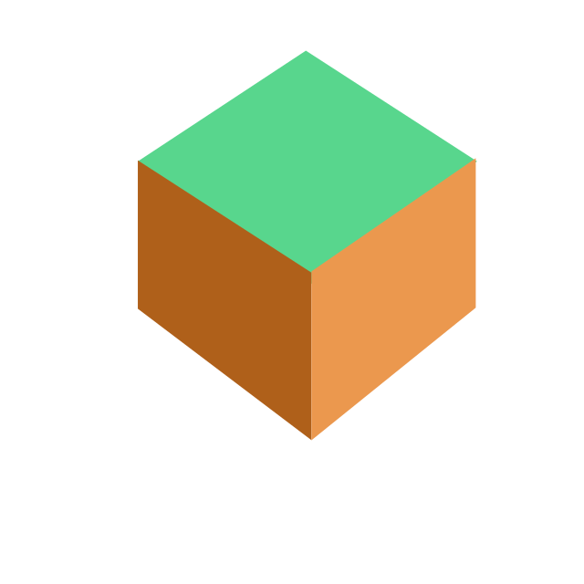

<!DOCTYPE html>
<html lang="en">
    <head>
        <meta charset="UTF-8">
        <meta http-equiv="X-UA-Compatible" content="IE=edge">
        <meta name="viewport" content="width=device-width, initial-scale=1.0">
        <title>Sleepy SMP</title>
        <link rel="stylesheet" href="main-style.css">
    </head>
    <body>
        <!-- Navigation bar -->
        

            <a href="index.html">Home</a>
            <h1>Sleepy SMP</h1>
            <a href="about.html">About</a>
        

        <!-- Page -->
        

            

                

                    <h1>Creative SMP Server</h1>
                    
We always come with most creative ideas.

                

                

                

                

                    <h1>Uptime</h1>
                    
Server uptime is 99.9%

                

            

        

         

        

            <h1 class="thin-header text-center">Sleepy SMP</h1>
            
        

         

        

            

                <h1 class="text-center">Perfomance</h1>
                
Good enough. No lag.

            

            

                <h1 class="text-center">Uptime</h1>
                
Server is online 24/7.

            

            

                <h1 class="text-center">Players</h1>
                
Players with creative ideas and teamwork.

            

            

                <h1 class="text-center">Specification</h1>
                

                    <ul>
                        <li>4 GB RAM</li>
                        <li>2 CPU Cores</li>
                        <li>50 GB SSD Storage</li>
                    </ul>
                

            

            

                <h1 class="text-center">Rules</h1>
                
No breaking rules and everyone satisfied.

            

            

                <h1 class="text-center">Host</h1>
                
zLotus2 and SleepySpeller

            

        

        <!-- Join Discord Server Button -->
        

            <a class="button-join text-light" href="https://discord.gg/q3XE7yMTWC">
                

                    Join Discord Server
                    
                

            </a>
        

         

    </body>
</html>
